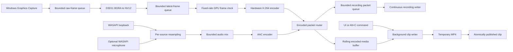

# Klip architecture

## Responsibilities

- `KlipApplication` is the composition root. It validates configuration, performs startup rollback, wires commands, runs the UI loop, and enforces shutdown order.
- `D3dDevice` owns the shared D3D11 device/context, UI swap chain, render target, and adapter identity.
- `GraphicsCapture` owns Windows Graphics Capture items, pools, and sessions; BGRA-to-NV12 video processing; the texture pool; GPU fence; and capture/conversion/encode workers.
- `VideoEncoder` owns FFmpeg D3D11 hardware contexts and the H.264 codec context. It discovers candidates, records rejection reasons, submits NV12 textures, normalizes timestamps, and emits encoded video packets.
- `AudioPipeline` owns WASAPI endpoint discovery, loopback and optional microphone clients, per-device resamplers, bounded source sample queues, and the mixer worker.
- `AudioEncoder` owns the AAC context and emits timestamped audio packets.
- `PacketRouter` fans each encoded packet into the replay buffer and, when enabled, one bounded recording queue. Recording never starts a second capture or encoder.
- `RollingMediaBuffer` owns cloned encoded packets. A mutex protects short ingest, eviction, statistics, and snapshot operations; mux I/O never runs while that mutex is held.
- `Mp4Muxer` is the shared remux/finalization boundary for clips and continuous recordings. It rebases timestamps, enforces stream DTS monotonicity, finalizes a temporary MP4, and atomically publishes the result.
- `ClipWriter` owns a bounded command queue and one background worker. It selects a keyframe-aligned packet snapshot and hands it to `Mp4Muxer`.
- `RecordingWriter` owns a bounded multi-producer packet queue and one worker. It waits for a video keyframe, drains the queue, and hands the live stream to `Mp4Muxer`.
- `ApplicationState` owns one mutex-protected snapshot. Workers publish complete state transitions; the UI reads a coherent value copy.
- `ConfigStore` persists validated user settings with a temporary-file replacement, while `UserPaths` resolves settings/log files under LocalAppData and media under the user's Videos known folder.
- `Win32Window`, `Hotkeys`, `ImGuiHost`, and `MainPanel` isolate window messages, global registration, backend lifetime, and rendering. `MainPanel` sees no WGC, WASAPI, D3D, or FFmpeg object.

## Data flow

## Ownership model

All component lifetimes are nested under `KlipApplication`; dependencies are constructor references, not global services. COM interfaces use `winrt::com_ptr`. WinRT capture objects are value wrappers with explicit event-token revocation. Kernel events use `ScopedHandle`. FFmpeg packets and codec parameters use `unique_ptr` deleters. Codec, format, resampler, and hardware contexts have one named owner and explicit no-throw shutdown fallbacks.

The D3D device is intentionally shared by COM reference between UI, capture, and video encoding. NV12 textures move through the SPSC queues as `com_ptr`. FFmpeg takes an additional reference while an encoder may retain a frame; its release callback either returns the texture to the capture pool or releases it after pool shutdown. The application flushes the video encoder while `GraphicsCapture` is still alive, so the callback target cannot dangle.

## Threading model

| Owner | Worker | Work | Cancellation |
|---|---|---|---|
| `GraphicsCapture` | target | Refreshes game/window and display choices and recreates the selected WGC session | `jthread` stop token plus `running` flag |
| `GraphicsCapture` | conversion | Pops BGRA textures, runs the D3D11 video processor, signals a fence | `jthread` stop token |
| `GraphicsCapture` | encoding | Retains the newest fenced NV12 texture and submits GPU copies on the configured frame clock | `jthread` stop token |
| `AudioPipeline` | desktop | Waits on the WASAPI loopback event and resamples packets | stop token plus signaled event |
| `AudioPipeline` | microphone | Waits on the selected capture endpoint and resamples packets | stop token plus signaled event |
| `AudioPipeline` | mixer | Aligns source timestamps, waits for complete AAC windows, then mixes/clamps samples | stop token plus sample-generation condition variable |
| `ClipWriter` | writer | Snapshots and muxes requested clips | closed bounded queue plus stop token |
| `RecordingWriter` | writer | Drains encoded packets into a keyframe-aligned MP4 | queue close; drains accepted packets before join |

No thread is detached. Every thread entry catches exceptions, updates `ApplicationState`, logs the failure, and exits. The two frame queues are SPSC and bounded; overflow drops the incoming frame and increments a metric. Audio source queues retain at most one second and treat large timestamp gaps as discontinuities.

WASAPI packets are commonly shorter than the AAC encoder's 1024-sample frame. The mixer does
not submit a partially populated encoder frame: it waits until every enabled source covers the
target timeline window, inserts silence only for a real timestamp gap, and then advances the
shared audio clock. This prevents packet cadence from becoming audible as periodic static.

## Shutdown sequence

1. The UI loop stops accepting commands and global hotkeys are unregistered.
2. WGC sessions close; capture, conversion, and encode workers receive stop requests and join.
3. WASAPI clients stop, their events wake, source and mixer workers join, and AAC input is flushed.
4. The video and audio encoders are flushed while their packet router and texture recycler are still live.
5. The recording queue closes and publishes its active file; the clip queue then finishes active and accepted requests.
6. Audio/video codec and hardware contexts are released, followed by the rolling packet buffer.
7. ImGui backends/context, swap chain/D3D device, and Win32 window are destroyed.
8. The final lifecycle event is flushed to `klip.log`; process-level WinRT unwinds after `wWinMain` returns.

Each initialization failure invokes the same idempotent shutdown path, so partial startup rolls back in reverse dependency order.

## Timestamp and clip selection

Video timestamps use elapsed QPC time expressed in 100-nanosecond units. WASAPI supplies its QPC position already converted to 100-nanosecond units; the shared origin is converted once before subtraction. Both codec time bases are `1/10,000,000` and packets retain their actual source time base in the buffer.

Clip selection finds the requested video threshold, walks back to a decodable keyframe (or forward to the first available keyframe), aligns audio at or after the selected start, and sorts cloned packets by DTS. The muxer computes one common A/V base timestamp, rebases in each source time base, then lets FFmpeg rescale to the stream time base.

## Error flow and observability

`Error` carries component, operation, readable message, optional native code/description, and context. Windows, HRESULT, and FFmpeg helpers preserve native details. Workers send errors to the state snapshot and logger; the UI never reads worker-owned mutable fields.

Metrics are lightweight atomics or values sampled outside critical loops: encoded FPS/count, source-frame count, both drop counts and queue depths, encode-call latency, clip-save duration, and rolling-buffer duration/bytes/packet count. Normal frames and packets are not logged.

## Performance-sensitive boundaries

- WGC callbacks only acquire the source texture and attempt one bounded enqueue.
- WGC frames are rejected before conversion when they arrive faster than the configured target FPS.
- A retained NV12 snapshot is copied GPU-to-GPU at the configured frame rate, preserving a fixed media timeline when a source is static without copying pixels through the CPU.
- Conversion and encoding run off the callback thread.
- The D3D11 multithread interface protects the shared immediate context.
- NV12 textures are recycled after FFmpeg releases them; resolution changes invalidate only the incompatible pool.
- Encoded packet payloads are reference-counted by FFmpeg and cloned only at rolling-buffer ingestion and clip snapshot.
- Recording queue packets are FFmpeg reference clones; the bounded queue prevents an unattended recording from growing memory without limit.
- Default raw and converted queues hold four frames each, the recording queue holds 512 packets, and the replay packet payload cap is 192 MiB.
- Rolling-buffer locks are never held during encoder calls or filesystem/MP4 operations.
- Clip muxing remuxes encoded packets; it does not transcode.

## Architecture decisions

The platform-independent `klip_core` target contains configuration validation, queue primitives, encoder ordering, range selection/timestamp rebasing, and state snapshots. Windows and FFmpeg integration lives in `klip_media`. Interfaces are limited to UI commands and codec-snapshot callbacks; internal components remain concrete to avoid virtual dispatch and abstraction overhead in hot loops.
